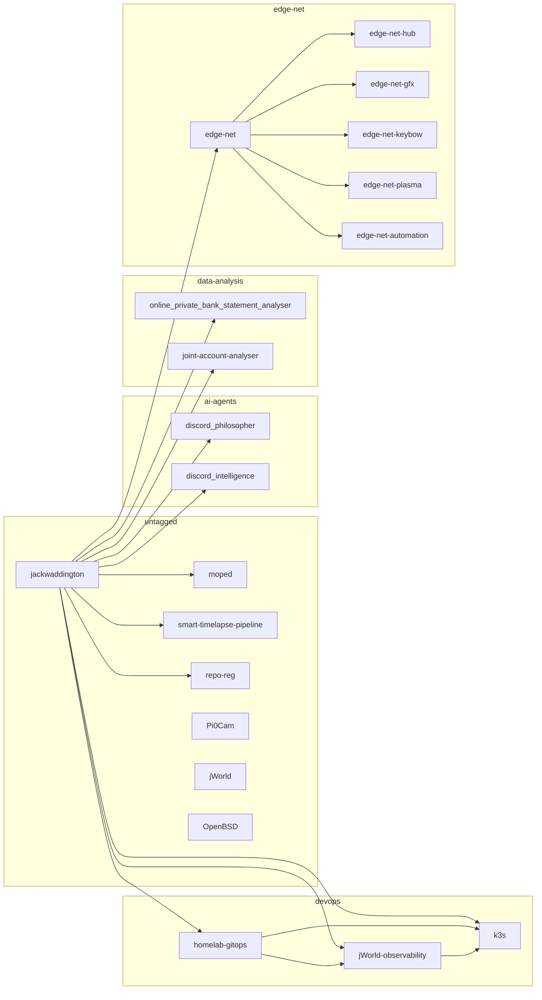

# repo-reg

CLI tooling to manage, map, and sync your GitHub repos from a single CSV registry.

## The problem

As your GitHub grows you lose track. What repos do you have? Which are public? How are they connected? When you sit down at a different machine, what should you pull?

This tooling gives you a CSV-based registry of all your repos, scripts to sync them across machines, and a visual map of how they connect — discovered automatically by scanning your code for cross-references.

## Quick start

```bash
# Prerequisites
brew install gh && gh auth login    # or: sudo apt install gh

# Clone and set up
git clone git@github.com:your-username/repo-reg.git ~/github/repo-reg
cd ~/github/repo-reg

# Create your registry and config from the examples
cp registry.csv.example registry.csv
cp ecosystem.md.example ecosystem.md
cp .env.example .env
# Edit .env: set GITHUB_USER="your-username"

# Discover all your repos from GitHub
./repo-discover.sh --update

# Edit registry.csv: set managed=yes on repos you want, add tags

# Clone everything marked as managed
./repo-sync.sh
```

## How I use it

**New machine — get everything:**

```bash
git clone <this-repo> ~/github/repo-reg && cd ~/github/repo-reg
./repo-discover.sh --update    # Fetches all repos from GitHub
./repo-sync.sh                 # Clones everything marked as managed
```

**Day-to-day:**

```bash
./repo-sync.sh                 # Clone missing, pull existing
./repo-query.sh unpushed       # Check for unpushed work
```

**Before leaving a machine:**

```bash
./repo-sync.sh --push          # Push all managed repos with unpushed commits
```

**After creating a new repo:**

```bash
./repo-discover.sh --update    # Finds it on GitHub
# Edit registry.csv: set managed=yes, add tags
./repo-sync.sh                 # Clones it locally
```

**Understanding the ecosystem:**

```bash
./repo-context.sh              # Generates CONTEXT.md for AI agents
./repo-map.sh                  # Generates visual MAP.md of connections
```

## The map

Set `ROOT_REPO` in `.env` to your GitHub profile repo and `repo-map.sh` does a BFS outward from it — following links forward, suppressing return arrows. Tag repos to group them into subgraphs.



Re-run `./repo-map.sh` anytime to refresh.

## Scripts

| Script | What it does |
| ------ | ------------ |
| `repo-query.sh` | Query and filter repos (by status, tag, visibility, managed) |
| `repo-sync.sh` | Clone missing, pull existing, push unpushed (with `--push`) |
| `repo-discover.sh` | Discover repos from GitHub API, sync descriptions (`--update`, `--push`) |
| `repo-create.sh` | Create new GitHub repos for managed entries not yet on GitHub (`--confirm`) |
| `repo-context.sh` | Generate `CONTEXT.md` — ecosystem context for AI agents |
| `repo-map.sh` | Generate `MAP.md` — Mermaid diagram of repo connections |
| `repo-cleanup.sh` | Find and safely remove untracked directories |

## CSV Schema

`registry.csv` fields:

| Field | Description |
| ----- | ----------- |
| repo_url | SSH clone URL |
| local_path | Path relative to $HOME |
| status | active / archived / experimental |
| visibility | public / private |
| k3s_deployed | yes / no (optional, for K8s users) |
| description | One-liner about the repo |
| tags | Semicolon-separated (e.g. `infra;portfolio`) |
| last_synced | ISO timestamp, set by repo-sync.sh |
| managed | yes / no — controls whether sync/push operates on this repo |

## Configuration

Copy `.env.example` to `.env` and set your GitHub username:

```bash
cp .env.example .env
# then edit .env:
GITHUB_USER="your-username"
```

`.env` is gitignored. Data files (`registry.csv`, `ecosystem.md`, `CONTEXT.md`, `MAP.md`) are also gitignored — they contain your personal repo data. Example files are provided to get started.

## Using from other repos/scripts

```bash
# Get absolute path to a repo
GITOPS_DIR=$(~/github/repo-reg/repo-query.sh path my-gitops-repo)

# Find all repos with a specific tag
~/github/repo-reg/repo-query.sh list --tag infra

# Pipe to other tools
~/github/repo-reg/repo-query.sh csv | grep active
```
